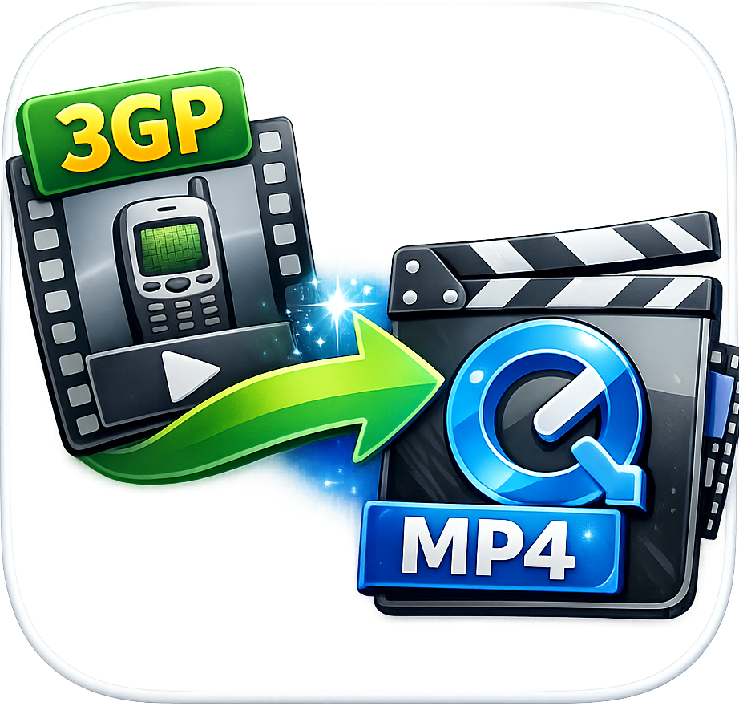
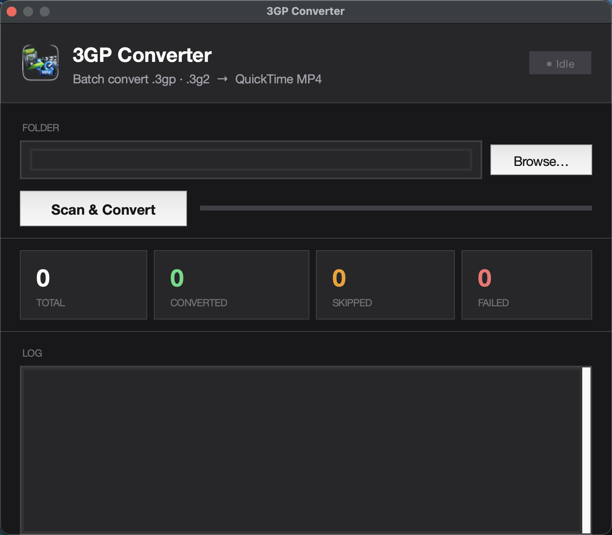

<p align="center">
  
</p>

<h1 align="center">3GP Converter</h1>

<p align="center">
  Batch-convert old <code>.3gp</code> and <code>.3g2</code> mobile videos to QuickTime-compatible MP4 — with smart upscaling and original timestamp preservation.
</p>

<p align="center">
  
  
  
  
  
</p>

<p align="center">
  
</p>

---

## Features

### Smart Conversion Strategy
3GP Converter doesn't blindly re-encode everything. It inspects each file first and chooses the fastest, highest-quality path:

| Condition | Strategy |
|-----------|----------|
| Video height ≥ 480p | **Stream copy** — zero quality loss, near-instant |
| Video height < 480p | **Re-encode + upscale** to 480p with H.264/AAC |
| Stream copy fails | Automatic fallback to H.264 re-encode |

### Timestamp Preservation
Converted files inherit the **original creation and modification dates** from the source — critical for keeping old memories sorted correctly in Photos, Finder, and media managers.

- `touch -r` preserves modification time
- `SetFile -d` restores the macOS creation date (`st_birthtime`)
- Container `creation_time` metadata is logged for reference

### Batch Processing
Drop a folder — every `.3gp` and `.3g2` file inside is queued and processed automatically. Already-converted files are detected and skipped so re-running is always safe.

### Real-Time Log
A colour-coded terminal-style log updates live as each file is processed:

- **White** — file headers and progress markers
- **Green** — successful conversions
- **Amber** — skipped files and warnings
- **Red** — errors and failures

### Status Dashboard
Four live counters update during the run:

| Counter | Meaning |
|---------|---------|
| **Total** | Files found in the folder |
| **Converted** | Successfully processed |
| **Skipped** | Output already existed |
| **Failed** | Errors during conversion |

A progress bar and status pill (`Idle → Working… → Done`) give instant feedback on the overall job.

---

## Requirements

| Dependency | Install |
|------------|---------|
| macOS 12 Monterey or later | — |
| [Homebrew](https://brew.sh) | `/bin/bash -c "$(curl -fsSL https://raw.githubusercontent.com/Homebrew/install/HEAD/install.sh)"` |
| ffmpeg | `brew install ffmpeg` |
| Xcode Command Line Tools *(for SetFile)* | `xcode-select --install` |

---

## Installation

### Option A — Download the app (recommended)

1. Go to [**Releases**](https://github.com/bytePatrol/3GP_To_Quicktime/releases)
2. Download `3GP.Converter.dmg`
3. Open the DMG and drag **3GP Converter** to `/Applications`
4. Launch from Spotlight or Launchpad

> **First launch:** macOS may show a Gatekeeper warning because the app is not notarised. Right-click → Open to bypass it.

### Option B — Run from source

```bash
# 1. Clone
git clone https://github.com/bytePatrol/3GP_To_Quicktime.git
cd 3GP_To_Quicktime

# 2. Install dependencies
brew install ffmpeg
xcode-select --install   # provides SetFile

# 3. Run
python3 convert_3gp.py
```

### Option C — Build your own .app

```bash
pip3 install py2app
python3 setup.py py2app
open dist/
```

The built app is in `dist/3GP Converter.app`.

---

## Usage

1. **Launch** 3GP Converter
2. Click **Browse…** and select the folder containing your `.3gp` / `.3g2` files
3. Click **Scan & Convert**
4. Watch the live log and counters — converted `.mp4` files appear alongside the originals

The original source files are never modified or deleted.

---

## How It Works

```
For each .3gp / .3g2 file in the selected folder:
  │
  ├─ [skip] .mp4 already exists → log "Skipped"
  │
  ├─ ffprobe: read video height
  │     │
  │     ├─ height ≥ 480p
  │     │     └─ ffmpeg stream copy (-c:v copy -c:a copy)
  │     │           ├─ success → preserve timestamps, done
  │     │           └─ failure → fall through to re-encode
  │     │
  │     └─ height < 480p (or unknown)
  │           └─ ffmpeg re-encode (libx264 -crf 22 -vf scale=-2:480)
  │                 └─ preserve timestamps
  │
  └─ Post: touch -r + SetFile -d to restore original dates
```

---

## Configuration

Constants at the top of `convert_3gp.py` can be edited to suit your setup:

```python
FFMPEG  = "/opt/homebrew/bin/ffmpeg"   # path to ffmpeg binary
FFPROBE = "/opt/homebrew/bin/ffprobe"  # path to ffprobe binary
SETFILE = "/usr/bin/SetFile"           # path to SetFile (Xcode CLT)

COPY_TIMEOUT   = 300   # stream-copy timeout in seconds
ENCODE_TIMEOUT = 600   # re-encode timeout in seconds
```

---

## License

[MIT](LICENSE) — free to use, modify, and distribute.
